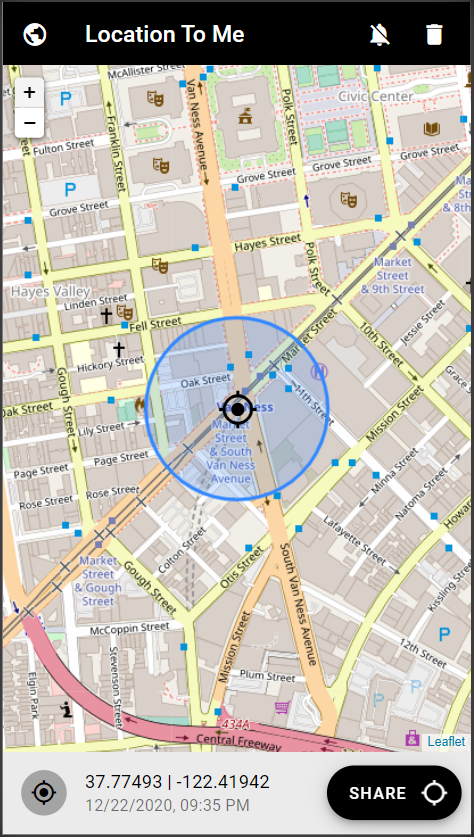

LOCATION TO ME
==============

Simple location sharing.  Hosted at [places.pipeto.me](https://places.pipeto.me/)



## Installation

With go installed:
```shell
go get -u github.com/jpschroeder/location-to-me
```

## Usage

```shell
location-to-me -h
  -baseurl string
        the base url of the service
         (default "http://localhost:8080/")
  -httpaddr string
        the address/port to listen on for http
        use :<port> to listen on all addresses
         (default "localhost:8080")
  -subscriber string
        the subscriber for web push notifications
         (default "contact@places.pipeto.me")
  -vapidprivatekey string
        the vapid private key for web push notifications
         (default "")
  -vapidpublickey string
        the vapid public key for web push notifications
         (default "")
```

## Building

In order to build the project, just use:
```shell
go build
```

## Deploying

See `scripts/install.sh` for remote installation

See `scripts/deploy.sh` for remote deployment
